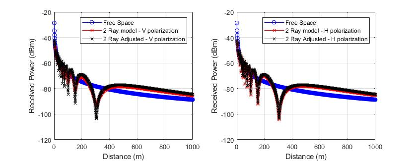

# Funções para calcular a Potência Recebida considerando o modelo de Dois Raios

- Função para calcular a potência recebida de acordo com o modelo de dois raios para o espaço livre [modelo2raios.m](./Utils/modelo2raios.m)
- Função para ajustar o modelo de dois raios de acordo com dados medidos [modelo2raiosAjustado.m](./Utils/modelo2raiosAjustado.m)
- Função para calcular o coeficiente de reflexão horizontal e vertical [reflectioncoefficient.m](./Utils/reflectioncoefficient.m)

## Exemplo de Uso Ajustando o modelo à equação de Friis

## :mag: Referências
- [1] Jordan E.C. and Balmain K.G. (1968) Electromagnetic Waves and Radiating Systems. Prentice Hall, New York
- [2] Viswanathan M. (2020) Wireless Communication Systems in Matlab